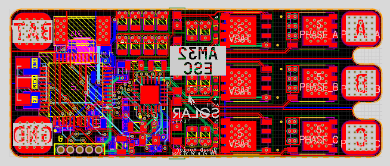

⚡ AM32_ESC

High-performance Electronic Speed Controller (ESC) for BLDC motors, designed as an engineering project in science club and a foundation for a future drone projects. 
Science club: AGH Solar Plane

🚀 Overview

This project is a custom-designed ESC based on the STM32G071CBT6 microcontroller, intended to run firmware compatible with AM32 architecture.

The goal is to create a robust, scalable, and efficient motor controller, while gaining full control over hardware and firmware design.

🧩 Features

 >🔧 STM32G071 (ARM Cortex-M0+)

 >⚡ 3-phase BLDC control

 >🧠 Compatible with AM32 firmware (planned)

 >📈 Current sensing (shunt-based)

 >🔌 External gate driver (DRV8300 series)

 >🛡️ TVS protection on power lines

 >🧪 Designed for ~80A operation (target)

🛠️ Hardware

>🔹 Microcontroller STM32G071CBT6

>🔹 Gate Driver DRV8300 (D or N variant depending on design)

>🔹 Current Sensing Low-side shunt resistor Amplifier: INA180

>🔹 Power Stage External MOSFETs (to be defined)

>🔹 Protection TVS diode (SMBJ series)

⚙️ Development Status

🚧 Work in progress
 - [x] Component selection
 - [x] Initial schematic
 - [x] PCB layout
 - [ ] Firmware integration
 - [ ] Testing & validation

PCB Layout:

⚠️ Disclaimer

This is an experimental hardware project.

Use at your own risk - high currents and voltages can be dangerous.

🤝 Contributing

Currently a science club engineering project, but feedback and ideas are welcome.

📜 License

To be decided.
